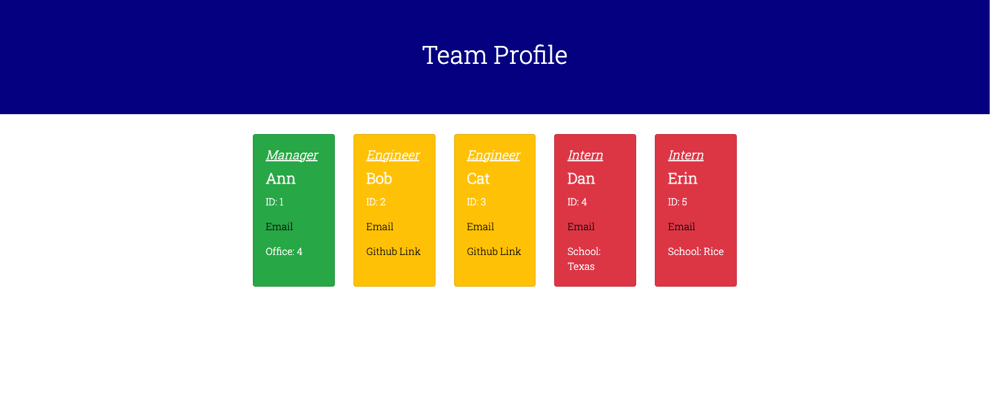

# homework-10
# Team Profile Generator

### The assignment was to generate a team profile generator with a class of employees and subclasses of manager, engineer, and intern. The questions asked for the profile varied a little based on the position help. Questions were set up in an array, which popped up in terminal when the index file was activated. I did a single array of questions as all three positions were asked three questions that were the same. For the fourth question, I'm prompted to choose their position and then asked the appropriate last question. Then I'm prompted to decide if I want to add another employee. Upon completion of adding employees, an HTML file is generated with cards on it that have the employee profiles. I separated the employee positions by color, with managers in green, engineers in yellow, and interns in red. 

## APIs or packages used:

### We were not given any started code. We were given a profile of folder organization and told to install inquirer. We also used Jest to run tests on the application. I got the cards for the id cards from Bootstrap. The font is from google fonts. The validator question for the email addresses was given to me by a developer friend who said it was a standard industry code. 

## Contibutions and references:

### There were several people in zoom rooms while working on this. Ethan Cho gave me some direction early on. Sue Lee was also in that meeting. Chuck Stephens and Mat Lundin helped me finish the index.js and pass the data through everything. Leah Nelson helped me refine my idea for setting up the HTML. My tutor, Ben Abbot, gave me a test question and Brad O'Dell also looked at my test questions.   

[Github Repository](https://github.com/bmalbright/homework-10)

[Video of the application working](https://drive.google.com/file/d/1pmNngfUl6cWOBYLKIT0O58YJ4TmgzaBo/view)

### The video is also available in the repo. 

